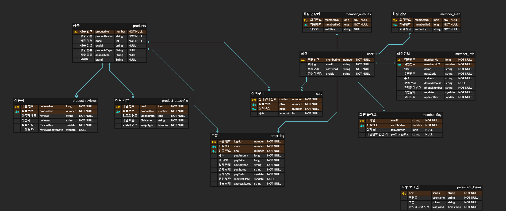

# Portfolio-v2

 

 **데모 : http://www.petshopsjh910203.site/**
 
 	* 구글 보안 문제 때문에 이메일을 사용하는 일반 회원 가입, 비밀번호 찾기는 사용할 수 없습니다(소셜 로그인은 가능)
	
 	* 관리자 계정 : ID psAdmin PW psadmin
	
	* 고객 계정 : 

 **1. 프로젝트 요약**

	- 프로젝트 명 : PETSHOP 반려동물 쇼핑몰 구축
	
	- 개발기간 : 4/16 ~ 11/26
	
	- 투입인원 : 1명
	
	- 프로젝트 소개 : 스프링 프레임워크를 이용한 mvc 모델 온라인 쇼핑몰을 구축했습니다
	
	- 개발목표 : 스프링 프레임워크, 스프링 시큐리티 등을 사용하여 실제 온라인 쇼핑몰과 같이 구축
		

**2. 개발환경**

	- 사용(개발) 언어 : JAVA
	
	- 사용 O/S : Window10
	
	- 사용 D/B : Oracle 11g xe
	
	- 사용(개발)  툴 : ECLIPSE, SQLDeveloper, Brackets
	
	- 웹 표준 기술 : HTML, CSS, JavaScript, jQuery
	
	- 프레임워크 : Spring Framework
	
	- 참고 서적 : 뇌를 자극하는 Java 프로그래밍, 코드로 배우는 스프링 웹 프로젝트

**3. 주요기능**
	
	- ajax를 이용한 화면 전환 없는 상품평 추가 기능
	
	- Oracle11g를 이용한 데이터 관리 기능

	- 스프링 시큐리티를 이용한 회원 관리 기능 
	
	- Google SMTP를 이용한 회원가입 인증 
	
	- OAuth 2.0을 이용한 소셜 로그인 
	
	- Google Cloud Platform의 가상머신을 이용한 실제 서버 가동
	
**4. ERD**

**5. 프로젝트 중 발생한 문제점**

	- 멘토의 부재
	
	- QA인원의 부재로 인해 버그 발견이 힘들어서 자연히 exception 처리도 허술하게 되었습니다
	
	- 코드 작성 경험 부족으로 코드 최적화가 안되는 문제 -> 불필요한 코드가 많아져서 모듈화로 중복으로 쓰이는 코드 최소화 필요합니다
	
**6. 개선점**

	- Github 커밋 단위를 파일 단위로 사용하기
	
	- 뷰 부분의 jsp 파일을 적당한 단위로 나눠 모듈화
	
	- 
	
