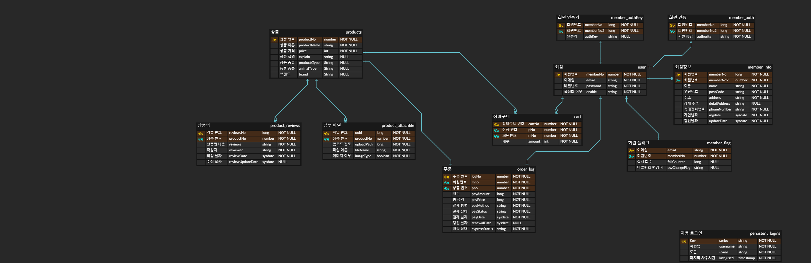

# Portfolio-v2

 **데모 : http://www.petshopsjh910203.site/**
 
 	* 구글 보안 문제 때문에 이메일을 사용하는 일반 회원 가입, 비밀번호 찾기는 사용할 수 없습니다(소셜 로그인은 가능)
 	* 관리자 계정 : ID psAdmin PW psadmin
	* 고객 계정 : 

 **TRELLO : https://trello.com/b/Mk4LiwEP/%ED%8F%AC%ED%8A%B8%ED%8F%B4%EB%A6%AC%EC%98%A4**
 
 	* 프로젝트를 진행하면서 발생한 문제점과 해결법 등을 기록해놓은 곳

 **1. 프로젝트 요약**

	- 프로젝트 명 : PETSHOP 반려동물 쇼핑몰 구축
	- 개발기간 : 4/16 ~ 11/26
	- 투입인원 : 1명
	- 프로젝트 소개 : 스프링 프레임워크를 이용한 mvc 모델 온라인 쇼핑몰을 구축했습니다
	- 개발목표 : 스프링 프레임워크, 스프링 시큐리티 등을 사용하여 실제 온라인 쇼핑몰과 같이 구축
		

**2. 개발환경**

	- 사용(개발) 언어 : JAVA
	- 사용 O/S : Window10
	- 사용 D/B : Oracle 11g xe
	- 사용(개발)  툴 : ECLIPSE, SQLDeveloper, Brackets
	- 웹 표준 기술 : HTML, CSS, JavaScript, jQuery
	- 프레임워크 : Spring Framework

**3. 주요기능**

	1 스프링 시큐리티를 이용한 회원 관리 기능
	2 Oracle11g를 이용한 데이터 관리 기능
	3 ajax를 이용한 화면 전환 없는 상품평 추가 기능
	4 Google SMTP를 이용한 회원가입 인증 
	5 OAuth 2.0을 이용한 소셜 로그인 
	6 Google Cloud Platform의 가상머신을 이용한 실제 서버 
	
**4. Backend architecture**

1. 프로젝트 기간

	* 전체 기간 4/16 ~ 11/26(총 8개월)
 
	* 4/16 ~ 5/3 스프링 환경 설정
 
	* 5/3 ~ 5/27 기본 상품 CRUD 완성

	* 5/28 ~ 6/6 페이징 기능 완성
 
	* 6/7 ~ 6/19 사이드 네비바 완성
 
	* 6/19 ~ 6/26 검색 기능 완성
 
	* 7/3 ~ 7/22 파일 업로드 CRUD 기능 완성
 
	* 7/22 ~ 8/1 상품평 기능 완성
 
	* 8/2 ~ 8/13 스프링 시큐리티 회원 기능 1차 완성
 
	* 8/14 ~ 9/20 스프링 시큐리티 회원 기능 2차 완성(이메일 인증, 주소 검색 기능, 이메일 중복 검사, 비밀번호 검사 등)
 
	* 9/21 ~ 10/6 장바구니 CRUD 완성
 
	* 10/7 ~ 11/25 OAuth 2.0 추가
 
	* 11/26 프로젝트 완성
 
	* 참고 서적 - 뇌를 자극하는 Java 프로그래밍,
	코드로 배우는 스프링 웹 프로젝트
 
2. 사용 기술
	* Back-end
	
		Java, Oracle11, myBatis, Spring Framework, Spring Security, JDK, Maven, Tomcat9

	* Front-End
	
		Html, Java Script, JQuery, Jstl, Bootstrap

3. 구현 기능
	* 게시판 CRUD
	
	* 상품평 CRUD
	
	* 검색
	
	* 파일 업로드
	
	* 스프링 시큐리티 회원 CRUD

	* 이메일 인증 기능
	
	* 도로 주소 검색 API
	
	* 이메일 중복 검사
	
	* 비밀번호 검사
	
	* 비밀번호 찾기
	
	* 회원가입 이메일 인증
	
	* OAUTH 2.0 로그인
	
4. 앞으로의 예정

	* Google OAuth 2.0 cors 에러 해결

	* OAuth를 서비스하는 각 회사에 따라 동적으로 작동하는 컨트롤러 기능 추가

	* 무료 도메인을 이용한 실제 서버 가동 - 2/10 완료
	
5. 프로젝트 중 발생한 문제점

	* 멘토의 부재
	
	* QA인원의 부재 -> 버그 발견 힘듬 -> exception 처리 힘듬
	
	* 노하우 부족으로 공통으로 쓰이는 코드 많음 -> 모듈화로 공통으로 쓰이는 코드 최소화 필요함
	
